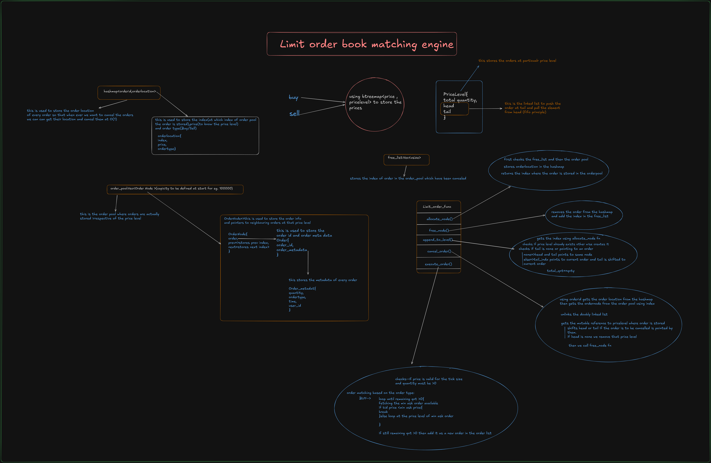

# Limit Order Book Matching Engine

A high-performance off-chain limit order book matching engine written in Rust.  
The engine is designed for low-latency order matching and can later be integrated with on-chain settlement systems such as the Solana blockchain.

---

## Overview

This project implements a **FIFO-based limit order book** using efficient in-memory data structures optimized for:

- Fast order insertion
- O(1) order cancellation
- Efficient order matching
- Memory reuse using pool allocation
- Separate buy/sell order books

The architecture is inspired by real-world exchange engines where:
- Matching happens **off-chain**
- Settlement can happen **on-chain**

---

## Core Architecture

### Order Book Structure

The order book maintains:

- Separate **Buy** and **Sell** sides
- Price levels using `BTreeMap`
- FIFO queues at each price level
- Memory pool for order storage
- HashMap for constant-time order lookup

---

# Data Structures

## 1. Price Levels

Each side of the book stores price levels using:

```rust
BTreeMap<Price, PriceLevel>
```

### Why `BTreeMap`?

`BTreeMap` provides:
- Sorted price levels
- Efficient best bid / best ask lookup
- Logarithmic insertion and removal

---

## 2. PriceLevel

Each price level contains:

```rust
PriceLevel {
    total_quantity,
    head,
    tail
}
```

### Responsibilities

A `PriceLevel`:
- Tracks total quantity at that price
- Maintains FIFO ordering
- Stores pointers to linked-list nodes

---

## 3. FIFO Queue per Price Level

Orders at the same price are stored using a linked list.

### Behaviour

- New orders are appended at the tail
- Executions happen from the head
- Preserves time priority (FIFO)

---

## 4. Order Pool

All orders are stored in a centralized memory pool:

```rust
order_pool: Vec<OrderNode>
```

### Purpose

The order pool:
- Stores all active orders
- Avoids frequent heap allocations
- Enables index-based linked lists
- Improves cache locality

### Example

```rust
order_pool: Vec<OrderNode> // capacity predefined
```

---

## 5. Free List

```rust
free_list: Vec<usize>
```

### Purpose

Stores indices of cancelled or freed orders.

### Benefits

- Reuses memory slots
- Prevents unnecessary allocations
- Reduces fragmentation

---

## 6. Order Lookup Table

```rust
HashMap<OrderId, OrderLocation>
```

### Purpose

Used for O(1) order cancellation.

### Stores

```rust
OrderLocation {
    index,
    price,
    order_type
}
```

This allows the engine to:
- Locate the order instantly
- Find the corresponding price level
- Remove it efficiently

---

# Order Node Design

## OrderNode

```rust
OrderNode {
    order,
    prev,
    next
}
```

### Purpose

Each node stores:
- Order information
- Previous node index
- Next node index

This creates an index-based doubly linked list inside the order pool.

---

## Order Structure

```rust
Order {
    order_id,
    order_metadata
}
```

---

## Order Metadata

```rust
OrderMetadata {
    quantity,
    order_type,
    time,
    user_id
}
```

Stores:
- Quantity
- Side (Buy/Sell)
- Timestamp
- User information

---

# Engine Functions

## allocate_node()

### Responsibilities

- Checks the `free_list`
- Reuses available indices
- Otherwise expands the order pool

### Returns

```rust
usize
```

The index where the order is stored.

---

## free_node()

### Responsibilities

- Removes order from lookup table
- Pushes freed index into `free_list`

---

## append_to_level()

### Responsibilities

- Creates price level if it does not exist
- Appends order to tail
- Maintains FIFO ordering

### Behaviour

If level is empty:

```text
head = tail = current_order
```

Otherwise:

```text
tail.next = current_order
tail = current_order
```

---

## cancel_order()

### Responsibilities

- Finds order using hashmap
- Removes from linked list
- Updates head/tail pointers
- Frees node memory

### Complexity

```text
O(1)
```

---

## execute_order()

### Responsibilities

- Matches incoming orders
- Consumes liquidity from opposite side
- Updates quantities
- Removes fully filled orders

---

# Matching Logic

## Buy Order Matching

A buy order:
- Matches against lowest sell prices
- Starts from best ask
- Continues until:
  - quantity becomes zero
  - no matching sell exists

---

## Sell Order Matching

A sell order:
- Matches against highest buy prices
- Starts from best bid
- Continues until:
  - quantity becomes zero
  - no matching buy exists

---

# Performance Optimizations

## 1. Pool Allocation

Using:

```rust
Vec<OrderNode>
```

instead of heap allocation:
- Improves cache locality
- Reduces allocator overhead
- Enables predictable memory usage

---

## 2. Index-Based Linked Lists

Using indices instead of pointers:
- Safer ownership model
- Easier serialization
- Better compatibility with Rust borrowing rules

---

## 3. O(1) Cancellation

Using:

```rust
HashMap<OrderId, OrderLocation>
```

allows direct access to orders.

---

## 4. FIFO Matching

Orders at the same price follow:
- Price priority
- Time priority

This mimics real exchange behaviour.

---

# Complexity Analysis

| Operation | Complexity |
|---|---|
| Add Order | O(log n) |
| Cancel Order | O(1) |
| Match Order | O(k) |
| Best Bid/Ask | O(log n) |

Where:
- `n` = number of price levels
- `k` = matched orders

---

# Future Improvements

Possible enhancements include:

- Market orders
- Stop-loss orders
- Iceberg orders
- Persistent snapshots
- Multi-threaded matching
- WebSocket feeds
- Risk engine integration
- On-chain settlement layer
- Trade event streaming

---

# Tech Stack

- **Language:** Rust
- **Async Runtime:** Tokio
- **Networking:** WebSockets
- **Data Structures:** BTreeMap, HashMap, Vec
- **Target Use Case:** Low-latency exchange infrastructure

---

# Future Blockchain Integration

The engine is designed for:

- Off-chain matching
- On-chain settlement

Potential settlement targets include:
- Solana
- EVM chains
- Custom rollups

---

# High-Level Flow

```text
Client Order
    ↓
WebSocket Gateway
    ↓
Matching Engine
    ↓
Order Book Update
    ↓
Trade Execution
    ↓
Settlement Layer
```

---

# Goals

This project aims to explore:

- Exchange infrastructure
- Low-latency systems
- Financial market mechanics
- Memory-efficient Rust design
- Off-chain matching architecture
- Blockchain settlement integration

---

# License

MIT License

